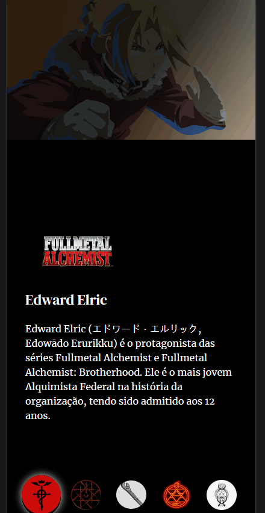

# Projeto Fullmetal Alchemist Personagens

Um projeto para testar e treinar JavaScript, Git Bash, HTML e CSS 🔥
O projeto tem como base os personagens do anime Full Metal Alchemist, cada página com um breve resumo dos personagens.

[Link do projeto](https://cezarviana.github.io/projeto-fullmetal-alchemist-personagens/)

## Imagens do Design criado

   

## Tecnologias utilizadas
- HTML
- CSS
- JS
- Git Bash

### Como utilizar

1 - Clone o projeto
***
git clone <https://cezarviana.github.io/projeto-fullmetal-alchemist-personagens/>
***

2 - Acessar a pasta do projeto
***
cd projeto-fullmetal-alchemist-personagens
***
