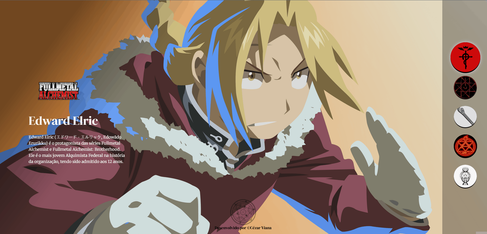
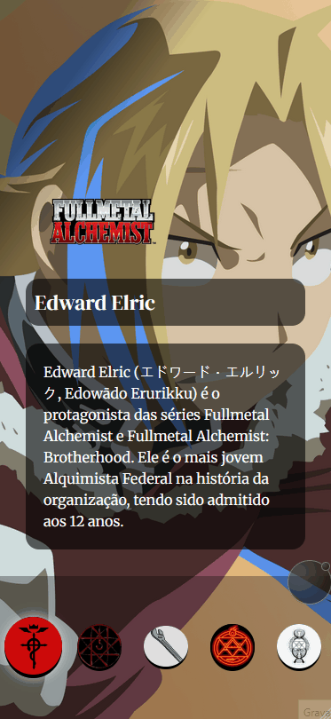

# ⚡ Projeto Fullmetal Alchemist Personagens

## 📝 Descrição do Projeto
O projeto tem como base os personagens do anime Full Metal Alchemist, cada página de personagem é selecionada a partir de botões individuais e estilizados. E cada botão seleciona a página específica do personagem com um breve resumo dele.

Acesse o site aqui: [Projeto Fullmetal Alchemist Personagens](https://cezarviana.github.io/projeto-fullmetal-alchemist-personagens/)

## 🔎 Funcionalidades
- Responsivo para todos os dispositivos
- Botões individuais e estilizados de seleção de personagens
- Páginas com o background e resumo dos personagens

## 🛠️ Ferramentas utilizadas
- **HTML:** Estruturação do projeto
- **CSS:** Estilização do projeto, responsivo e menu hamburguer
- **JavaScript:** Campos de busca, procura e entrega dos itens buscados em tela
- **Git:** Ferramenta de versionamento

## 🎨 Imagens do projeto

<div align="center">
 <br><br>

</div>

## 💡 Decisões do projeto
1. **Escolha do uso de Botões para a seleção cada personagem**
- O uso de botões era o desafio do projeto. Para utilizar o JavaScript neste processo de "desseleção" e seleção de outro personagem a partir de um único `click`. 

2. **Escolha das Imagens**
- As imagens dos personagens deveriam seguir um padrão similar, para não destoar uma página da outra.

3. **Escolha da personalização dos Botões**
- Cada personagem tem um botão próprio que faz refência com sua história no anime.

4. **Nomes na língua original**
- Achei que seria interessante inserir além dos nomes traduzido, os nomes originais em japonês na forma de Katakana ("Alfabeto" para palavras de origem estrangeiras urilizado no Japão).

## 💦 Dificuldades do projeto
- Encontrar imagens para o background em boa qualidade que preenchesse o formato Full HD (1920x1080p).
- Ajustar as imagens do background para o formato mobile (Melhorar aqui).

## 🔓 O que eu aprendi
- Utilizar o JS para a executar "desseleção" e seleção de outro personagem a partir de um único `click`. 
- Trabalhar com imagens para melhorar a disposição e a apresentação delas no projeto.

## 💭 Possíveis atualizações futuras
- Finalizar o README ✅
- Melhorar as imagens do background, talvez com o uso de IA

## 🚀 Como rodar o projeto
Siga os passos abaixo para executar o projeto na sua máquina:

### Pré requisitos

- <strong><i>Git</i></strong>: Para clonar o repositório.


1. Abra o git, e execute os seguintes comandos
2. **Clonar o repositório:**
   ```bash
   git clone https://cezarviana.github.io/projeto-fullmetal-alchemist-personagens/
   ```
3. npm install
4. npm run dev
5. **Abrir o arquivo index.html:** Abra o arquivo `index.html` em um navegador web.
